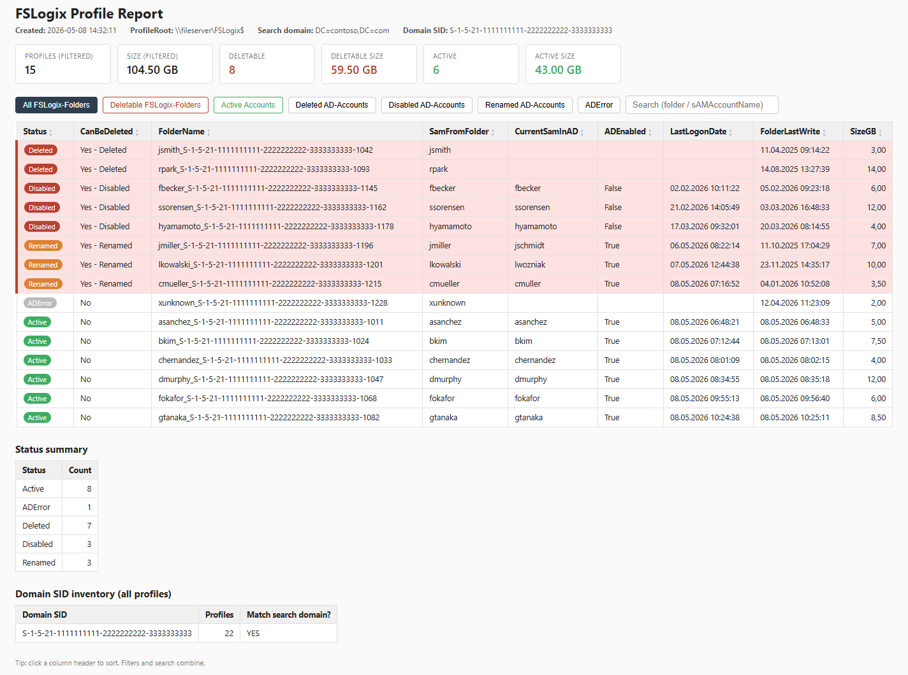
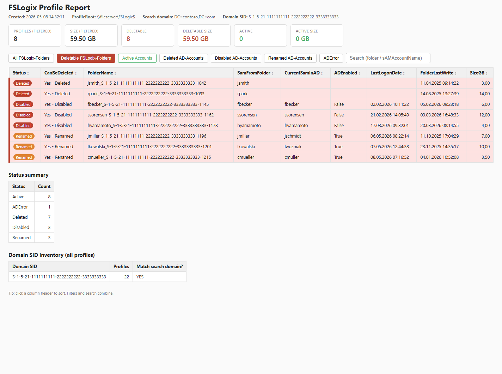

# FSLogix Orphaned-Profile Cleanup

PowerShell tooling to identify and quarantine orphaned **FSLogix** profile folders
on a file share. Profiles are matched against Active Directory **by SID** (not by
sAMAccountName), so renamed accounts are detected reliably.



The interactive HTML report groups every detected profile by status, lets you
filter by deletable vs. active, and shows live size totals at the top. One click
on **Deletable FSLogix-Folders** narrows the table down to just the cleanup
candidates and updates the totals accordingly:



The toolkit ships with two scripts:

- **`Find-OrphanedFSLogixProfiles.ps1`** — scans a profile share, looks each profile
  up in AD via LDAP, and produces an interactive HTML report plus a CSV.
- **`Move-OrphanedFSLogixProfiles.ps1`** — reads that CSV and moves the orphaned
  profile folders into a quarantine directory. Supports `-WhatIf`, `-Confirm`, and
  writes an audit log of every operation.

No RSAT/ActiveDirectory module required. No ADWS (TCP 9389) required. All AD lookups
go through standard LDAP (TCP 389/636) using `System.DirectoryServices`.

---

## Why SID-based matching?

FSLogix profile folders are named `<sAMAccountName>_<SID>`, e.g.
`jdoe_S-1-5-21-1111-2222-3333-1001`. The sAMAccountName is **mutable** (rename on
marriage, naming-convention change, typo fix), but the SID is **immutable** for the
lifetime of the account. Matching by sAMAccountName produces false positives every
time someone is renamed; matching by SID does not.

---

## Status classification

| Status        | Meaning                                                                        | CanBeDeleted   |
|---------------|--------------------------------------------------------------------------------|----------------|
| `Active`      | Account exists in AD, enabled, sAMAccountName matches the folder name          | No             |
| `Deleted`     | No AD account exists for this SID anymore                                      | Yes            |
| `Disabled`    | Account exists but is disabled                                                 | Yes            |
| `Renamed`     | Account exists, but its current sAMAccountName differs from the folder's name. FSLogix has created a new folder under the new name; the old folder is orphaned | Yes |
| `OtherDomain` | The folder's SID does not belong to the connected domain                       | No (default)   |
| `ADError`     | LDAP lookup error                                                              | No             |

The `CanBeDeleted` column carries a short reason such as `Yes - Deleted`,
`Yes - Disabled`, or `Yes - Renamed` so the basis for each decision is visible at
a glance.

---

## Requirements

- Windows PowerShell 5.1 or PowerShell 7+
- Read access to the FSLogix profile share
- Read access to AD over LDAP (port 389 or 636)
- Write access to the quarantine target (Move script only)

The Find script does **not** need the RSAT ActiveDirectory module and does **not**
talk to AD Web Services on port 9389. It uses `System.DirectoryServices` directly.

---

## Quick start

### 1. Find orphans and produce a report

```powershell
.\Find-OrphanedFSLogixProfiles.ps1 -ProfileRoot '\\fileserver\FSLogix$'
```

This scans the share, reads each profile folder name, looks the SID up in AD, and
produces three files in the current directory:

- `FSLogix-Inventory-<timestamp>.csv` — every detected FSLogix folder
- `FSLogix-Report-<timestamp>.csv`    — non-Active profiles only (input for the Move script)
- `FSLogix-Report-<timestamp>.html`   — interactive HTML report (see below)

### 2. Inspect the HTML report

Open `FSLogix-Report-<timestamp>.html` in any browser. The page provides:

- **Live tiles** at the top — counts and total size for the current filter, plus
  separate tiles for "Deletable" and "Active" profiles
- **Filter buttons** — `All`, `Deletable`, `Active`, `Deleted`, `Disabled`,
  `Renamed`, `ADError`
- **Search box** — case-insensitive substring match across all columns
- **Sortable columns** — click any column header (numeric and date columns sort
  correctly)
- **Color highlighting** — rows with `CanBeDeleted = Yes` are tinted red

### 3. Quarantine the orphans (with `-WhatIf` first!)

```powershell
.\Move-OrphanedFSLogixProfiles.ps1 `
    -ReportCsv      '.\FSLogix-Report-20260508-105143.csv' `
    -ProfileRoot    '\\fileserver\FSLogix$' `
    -QuarantineRoot '\\fileserver\FSLogix$\_Quarantine' `
    -IncludeStatus  Deleted,Disabled,Renamed `
    -WhatIf
```

Drop `-WhatIf` to perform the actual move. Each run creates a new subdirectory
`<QuarantineRoot>\<timestamp>\` and an audit log
`FSLogix-Move-<timestamp>.log.csv` next to the report CSV.

> **Tip:** put `QuarantineRoot` on the **same volume** as `ProfileRoot`. Then
> `Move-Item` is a fast atomic rename. Across volumes it becomes a copy + delete,
> which is slower and has a wider failure window.

---

## Find-OrphanedFSLogixProfiles.ps1

```
.\Find-OrphanedFSLogixProfiles.ps1
    -ProfileRoot              <path>          # mandatory: profile share root
    [-OutputDir               <path>]         # default: current directory
    [-Server                  <fqdn>]         # specific DC (e.g. dc01.contoso.com)
    [-Credential              <pscredential>] # for cross-domain runs
    [-AssumeOtherDomainDeleted]               # rare; only after confirmed migration
    [-SkipSize]                               # skip per-folder size scan (faster)
```

### What the script does

1. Enumerates `ProfileRoot` for subfolders matching `<sam>_<S-1-5-21-...>`.
2. Reads `RootDSE` to discover `defaultNamingContext` and the domain SID.
3. For each unique SID, runs an LDAP search by binary `objectSid` and reads
   `samAccountName`, `userAccountControl` and `lastLogonTimestamp`.
4. Classifies each profile (see status table above).
5. Measures profile size (`Get-ChildItem -Recurse | Measure-Object -Sum Length`)
   unless `-SkipSize` is set. Most FSLogix folders contain only 1–2 VHDX files,
   so this is usually fast even over SMB.
6. Writes Inventory CSV, Report CSV and Report HTML.

### Naming format

The script expects the default FSLogix folder pattern `<sam>_<SID>`. The reverse
form `<SID>_<sam>` produced by `FlipFlopProfileDirectoryName=1` is **not**
supported; folders not matching the expected regex are silently skipped.

### Last-logon timestamp

The script uses `lastLogonTimestamp` (replicated, ~14-day tolerance), not
`lastLogon` (per-DC, requires querying every DC). For cleanup purposes the
14-day fuzz is acceptable.

---

## Move-OrphanedFSLogixProfiles.ps1

```
.\Move-OrphanedFSLogixProfiles.ps1
    -ReportCsv       <path>                              # mandatory
    -ProfileRoot     <path>                              # mandatory
    -QuarantineRoot  <path>                              # mandatory
    [-IncludeStatus  Deleted | Disabled | Renamed ...]   # default: Deleted
    [-CheckOpenFiles]                                    # SMB lock check
    [-WhatIf] [-Confirm]
```

### Safety features

- `[CmdletBinding(SupportsShouldProcess, ConfirmImpact='High')]` — every move
  honors `-WhatIf` and `-Confirm`.
- Sources are reconstructed as `Join-Path $ProfileRoot $row.FolderName`. If the
  folder no longer exists at move-time, the entry is skipped with `Result =
  Skipped`.
- The script never moves `Active`, `OtherDomain`, or `ADError` rows. `Renamed`
  and `Disabled` require explicit opt-in via `-IncludeStatus`.
- The script never deletes anything. Quarantined folders sit in a dated subfolder
  ready for restore or for manual deletion after a retention period.
- An audit-log CSV records source path, destination path, status, result, and
  any error message for every operation.

### `-CheckOpenFiles`

Calls `Get-SmbOpenFile` to skip profiles whose VHDX is currently mounted. This
only works when the script runs **on the file server itself** (or via PowerShell
Remoting onto it). On a remote admin workstation `Get-SmbOpenFile` returns
nothing useful; the lock check then silently passes through, so prefer running
during a maintenance window in that case.

---

## Generated files

| File                                  | Purpose                                                        |
|---------------------------------------|----------------------------------------------------------------|
| `FSLogix-Inventory-<ts>.csv`          | Every detected FSLogix folder, raw inventory                   |
| `FSLogix-Report-<ts>.csv`             | Non-Active profiles, used as input for the Move script         |
| `FSLogix-Report-<ts>.html`            | Interactive HTML report with filters and live size totals      |
| `FSLogix-Move-<ts>.log.csv`           | Audit log of one Move run (next to the Report CSV)             |

These files contain real account names and SIDs, so they are excluded from version
control via `.gitignore`.

---

## Limitations

- Reverse FSLogix naming (`FlipFlopProfileDirectoryName=1`) is not supported.
- Only `S-1-5-21` (regular user) SIDs are processed; well-known SIDs are ignored.
- The `OtherDomain` status is conservative on purpose — it does not treat the
  profile as deletable. Use `-AssumeOtherDomainDeleted` only after confirming
  via the *Domain SID inventory* table at the bottom of the HTML report that
  the foreign SIDs actually come from a defunct migration source.
- `Get-SmbOpenFile` works only on the local file server.

---

## Troubleshooting

**Most profiles end up as `OtherDomain`.**
The script extracted the wrong domain SID. Pass `-Server <fqdn-of-correct-DC>`
and re-run. The HTML report's *Domain SID inventory* table shows which SID
prefixes appear in the profile folders so you can sanity-check the auto-detected
domain SID.

**Most profiles end up as `Deleted`/`ADError`.**
LDAP lookups are failing. Check:
- can the running account read the user objects in AD?
- is TCP 389 (or 636) reachable from this machine?
- is `-Server` pointing to a DC that actually replicates the user-containing OUs?

**`Join-Path : Argument cannot be bound to parameter "Path" because it is empty`
in the Move script.**
This happens if `-ReportCsv` was passed as a bare filename without a directory.
Use a full path or run from the directory containing the CSV. The current
script resolves relative paths internally.

---

## License

MIT — see [LICENSE](LICENSE).
